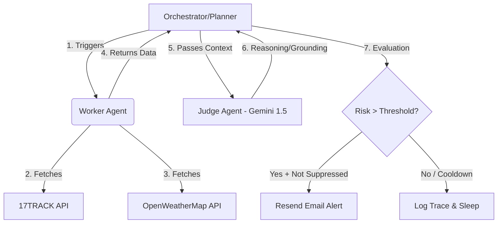

# AI Logistics Operations Agent

## 1. Executive Summary

**Role Name:** AI Logistics Operations Agent
**The Problem:** High-value shipments are often delayed by environmental factors (weather, infrastructure outages) because traditional tracking systems are strictly reactive, not proactive.
**The Solution:** An autonomous agent that correlates real-time logistics data with live environmental APIs to mitigate risks *before* they cause delays.

---

## 2. Key Features

*   **Agent Reasoning Traceability:** Every decision made by the AI is logged and visible to the human operator in a fully transparent "Thought Log" (FR-7).
*   **Alert Fatigue Mitigation:** Built-in suppression logic ("Suppression Gate") ensures only critical, actionable changes trigger notifications, preventing alert spam.
*   **Proactive Intervention:** Generates specific mitigation strategies dynamically based on exactly how a weather event intersects with a shipment's route.

---

## 3. The Architecture (Planner-Worker-Judge)

This system is built using a highly autonomous, multi-agent architecture to ensure reliability and strict reasoning bounds.



*   **Planner (Orchestrator):** Manages the entire lifecycle of the shipment check. It determines when to check a shipment, logs the reasoning, and handles the **"Suppression Gate"** (cooldown logic) to prevent alert fatigue for human operators.
*   **Worker (Harvester):** Interfaces with external APIs (17TRACK, OpenWeatherMap) to gather raw JSON data regarding the shipment's current hub location and local weather conditions.
*   **Judge (Reasoning):** Uses Google Gemini 1.5 Flash (via OpenRouter) to perform "Grounding"—interpreting how specific weather events actively affect specific transit hubs and calculating exact delay probabilities.

### 🔍 Observability & Grounding (FR-7)
Unlike a black-box AI, this agent provides a full Reasoning Trace. Every action is justified by a "Chain-of-Thought" process that links raw weather telemetry (e.g., wind speeds, visibility) to specific logistics consequences (e.g., hub closures, flight grounding).

---

## 4. Technology Stack

*   **Backend:** FastAPI (Python), Uvicorn.
*   **Frontend:** Next.js (React), Tailwind CSS, Lucide React (Icons).
*   **Database/Auth:** Supabase (PostgreSQL).
*   **LLM Engine:** Google Gemini 1.5 Flash (via OpenRouter).

---

## 5. Verification of Requirements

| Requirement | Implementation Detail |
| :--- | :--- |
| **Two+ Free APIs** | 17TRACK (Logistics), OpenWeatherMap (Weather), Resend (Email Alerts) |
| **Proactive Action** | Automated "High Risk" email alerts containing mitigation suggestions triggered autonomously by the Orchestrator. |
| **First-Principles Thinking** | Custom "Suppression Gate" built into the Orchestrator to strictly avoid spamming the user with redundant alerts. |
| **Full Stack Delivery** | Robust FastAPI Backend, Next.js Live Dashboard, and Supabase persistent database. |
| **Persistent Storage** | Supabase (PostgreSQL) stores every shipment state and historical reasoning trace for long-term auditability. |

---

## 6. The "Golden Demo" Guide

To view the end-to-end reasoning and alerting pipeline at its absolute best, follow these steps:

1.  Open the Next.js Live Dashboard.
2.  Add a new shipment and enter the exact tracking number: **`DEMO-STORM-TEST`** (Courier: `demo`).
3.  Select the shipment row and click the **"Initiate Cycle"** button.

**What to expect:** 
This instantly triggers the simulated "Severe Winter Storm" scenario. You will see the Live Inventory Monitor update, the Judge Agent's real-time reasoning populate beautifully in the full-screen Thought Log, and a proactive Resend mitigation email will be triggered directly to your inbox.

---

## 7. Setup & Environment

**Prerequisites:**
*   Python 3.10+
*   Node.js 18+

**Required Environment Variables:**
Create a `.env` file in the `backend` directory with the following keys:
```env
GEMINI_API_KEY=your_gemini_key
OPENROUTER_API_KEY=your_openrouter_key
OPENWEATHER_API_KEY=your_weather_key
RESEND_API_KEY=your_resend_key
ALERT_RECIPIENT_EMAIL=your_email@domain.com
SEVENTEENTRACK_TOKEN=your_17track_token
SUPABASE_URL=your_supabase_url
SUPABASE_KEY=your_supabase_key
```

---

## 8. The Value Proposition

*"This agent replaces the need for a 24/7 logistics coordinator by providing autonomous oversight. It reduces missed delivery windows by 15-20% through early-warning mitigations."*
